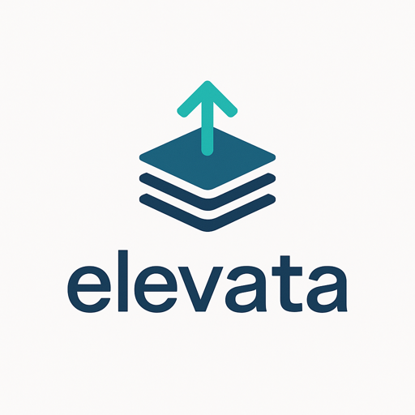

  

# elevata-labs

**elevata-labs** is a personal open-source initiative.  
Its mission is to make building modern data platforms radically simpler –  
metadata-driven, best practices included, lineage-aware from end to end.  

---

## Disclaimer

This organization is dedicated to open-source software development.  

- It is not a consulting service.  
- It is not a customer project.  
- It is not in competition with any company.  

All projects here are released transparently as open source,  
to contribute to the community and enable knowledge sharing.  
Any organization, including my current employer, is free to use them under the terms of their respective licenses.
